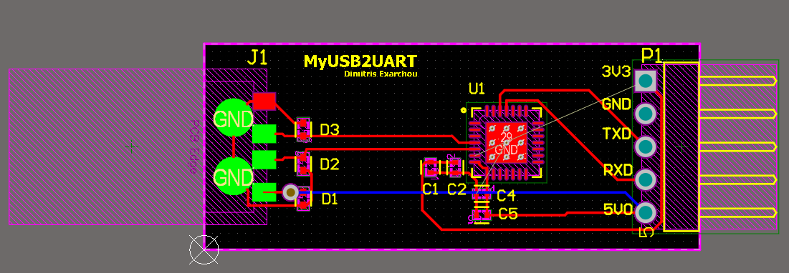
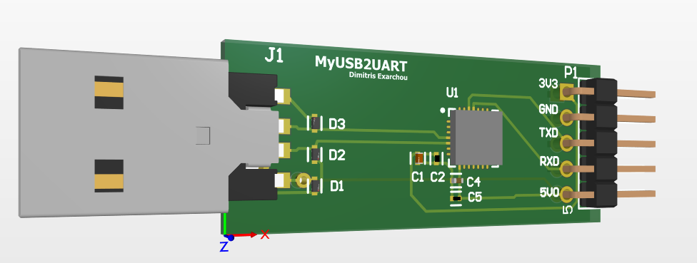

# Altium 5V Regulator PCB design

This project involves the schematic and PCB design of a 5V Voltage Regulator using commercial components and the add-on Altium Library Loader.

For the design I used capacitors, LM7805 regulator and a Schottky diode.

### Schematic

### PCB

----

# Buck Converter with Altium

This project involves the schematic design and Simulation of a Buck converter of a Buck Converter with Altium, as it was assigned for my Power Electronic courses. 

### Requirements

Vin = 12V

Vout = 5V

I_load= 2A

f = 400KHz

Duty cycle = Vin/Vout = 5/12 = 0.416

### Schematic

### PWD simulation with V2

### Simulation

---

# USB to UART PCB

The Silicon Labs' CP2102 is a small module designed to convert interfaces between USB and UART, serving as a convenient interface converter.

### CP2102-GM

### Schematic

The PCB design will consist of a two-layer configuration where all the components will be placed on the top layer.

### PCB 2D

### PCB 3D

