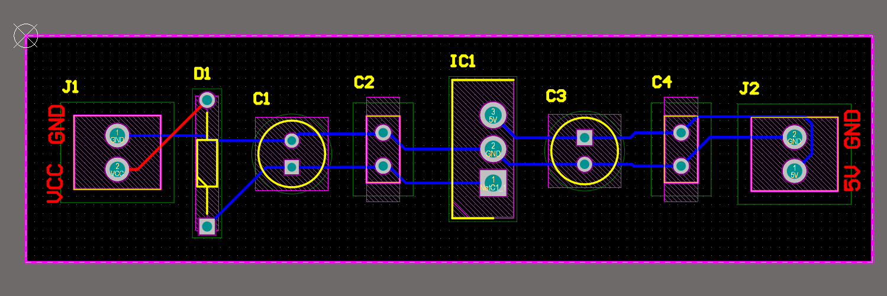

# PCB Design for ARM Cortex-M3

This project involves the schematic and PCB design of an Arduino like PCB for ARM Cortex-M3 MCU. 

A 9V Battery connector and a Voltage Regulator were used from the side of the Power Supply.

For the MCU, several circuits were designed, such as Bypass Capacitors for the Analog and Digital Power, Crystal Oscillators, Reset Button, Serial Wire Debug Interface, Boot Options and the routing of 30 GPIO pins.

### Schematic MCU

### Schematic Power Supply

### PCB before Polygons

### PCB after Polygons

### Bill of Materials

---

# Altium 5V Regulator PCB design

This project involves the schematic and PCB design of a 5V Voltage Regulator using commercial components and the add-on Altium Library Loader.

For the design I used capacitors, LM7805 regulator and a Schottky diode.

### Schematic

### PCB

----

# Buck Converter with Altium

This project involves the schematic design and Simulation of a Buck converter of a Buck Converter with Altium, as it was assigned for my Power Electronic courses. 

### Requirements

Vin = 12V

Vout = 5V

I_load= 2A

f = 400KHz

Duty cycle = Vin/Vout = 5/12 = 0.416

### Schematic

### PWD simulation with V2

### Simulation

---

# USB to UART PCB

The Silicon Labs' CP2102 is a small module designed to convert interfaces between USB and UART, serving as a convenient interface converter.

### CP2102-GM

### Schematic

The PCB design will consist of a two-layer configuration where all the components will be placed on the top layer.

### PCB 2D

